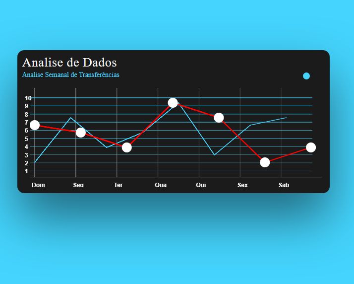

# MINI DATA ANALISYS API
>( PLOT ANY KIND OF DATA WICH HAS ROWS AND COLS)
- 

## Style Part
```css
:root{
    --primary-color:#44d4fd;
    --color-label:#a7a7a7;
    --coloor-text:#e2dede;
    --font-family:'Montserrat';
    --card-bg-color:#1b1b1b;
}
body{
    height: 100vh;
    background: var(--primary-color);
    display: grid;
    place-items: center;
    font-family: var(--font-family);
}
.card{
    position: relative;
    width: 610px;
    padding: 10px;
    border-radius: 14px;
    background: var(--card-bg-color);
    box-shadow: 0 50px 100px rgba(0, 0, 0, 0.5);
}

```
> Reading styles from Css files
```javascript
const colorPrimary =getComputedStyle(document.documentElement).getPropertyValue('--primary-color').trim()`#44d4fd`
const colorLabel =getComputedStyle(document.documentElement).getPropertyValue('--color-label').trim() `#a7a7a7`
const fontFamily =getComputedStyle(document.documentElement).getPropertyValue('--font-family').trim()
```

# Configuracoes iniciais do canvas
```js
const canvas =document.getElementById('canvas')
const ctx =canvas.getContext('2d')
```
Precisisarei das alturas de width e height do canvas separado 
1. Canvas
    - graphic_width e 
    - graphic_height
```js
const width=600
const graphic_width=580;
const height=200
const graphic_height=180;
canvas.setAttribute('width',width)
canvas.setAttribute('height',height)
```
